**Linux**

Introduction of Linux

i.  Linux was created by linus Torvalds in 1991

ii. It is open source operating system and secure operating system

    **Linux system architecture**

    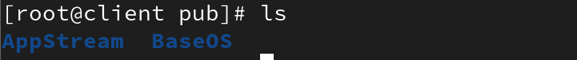{width="5.05in"
    height="3.8916666666666666in"}

    **Hardware**

<!-- -->

i.  It is the Physical Component of linux

ii. Moniter,CPU,Hard disk etc...

    **Kernal**

<!-- -->

i.  It is the core component of linux

ii. It acts as the brain of linux os

    **Shell**

<!-- -->

i.  It is the interface of the kernal and it is also a software

ii. It takes command for the user and interprets them (ie binary to
    human's language)

    **Commands in linux**

<!-- -->

i.  To create directory - **mkdir (directory name)**

    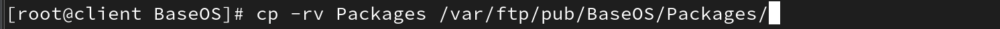{width="3.95in" height="0.7in"}

ii. To verify (list) the directory or file-**ls**

    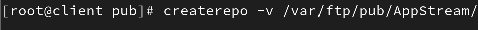{width="5.766666666666667in"
    height="0.4548611111111111in"}

<!-- -->

3.  To change directory from one to another **-cd**

    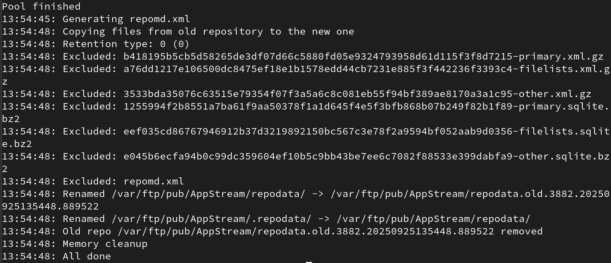{width="5.763888888888889in"
    height="0.6625in"}

4.  To know the present working directory **-pwd**

    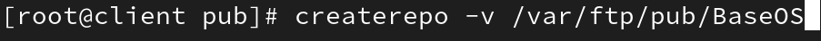{width="3.683333333333333in"
    height="0.9666666666666667in"}

5.  To create file **-touch file name**

    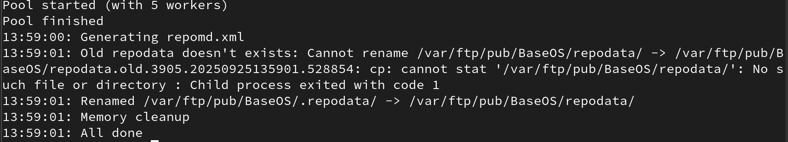{width="4.491666666666666in"
    height="1.5166666666666666in"}

6.  To delete file **-rm**

    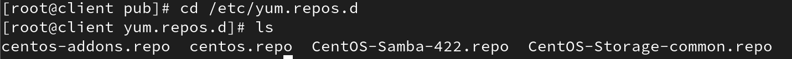{width="4.5in"
    height="2.0083333333333333in"}

7.  To move to previous directoty **-cd ..**

    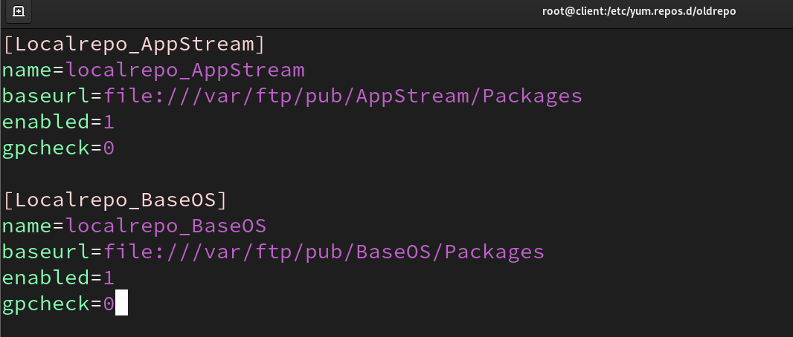{width="5.763888888888889in"
    height="0.6486111111111111in"}

[Change to Previous Directory:]{.underline}

Moves up one level in the directory hierarchy, to the parent directory.

Syntax:

#cd ..

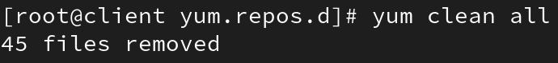{width="3.341666666666667in"
height="0.475in"}

[Change to Current Directory:]{.underline}

Syntax:

#cd .

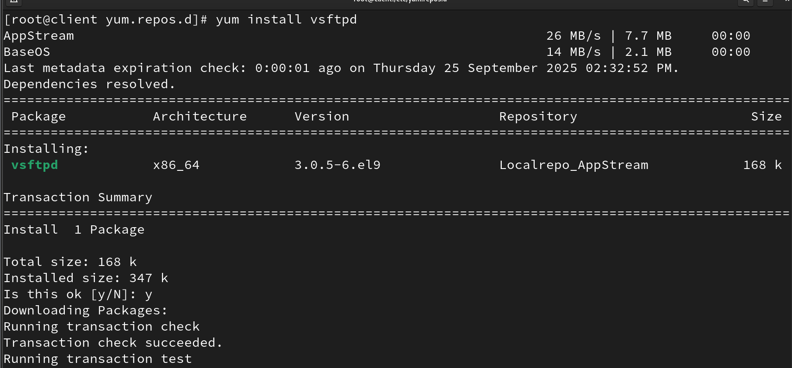{width="2.941666666666667in"
height="0.8083333333333333in"}

[Change to Root Directory:]{.underline}

Returns to the user\'s home directory.

Syntax:

#cd

{width="2.725in"
height="0.7666666666666667in"}

[Present working directory:]{.underline}

The pwd command in Linux stands for \"print working directory.\" Its
primary function is to display the full path of the current directory
you are currently located in within the file system. 

Syntax:

#pwd

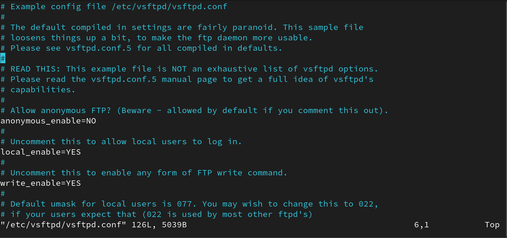{width="3.691666666666667in"
height="1.0583333333333333in"}

[Create an empty file:]{.underline}

If a specified file does not exist, "touch" command will create a new,
empty file with that name. 

Syntax:

#touch file_name

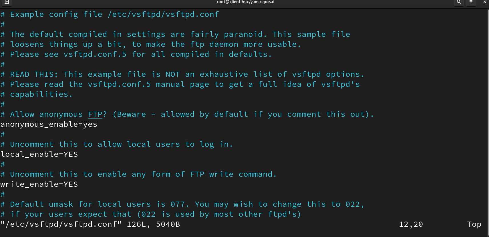{width="5.760416666666667in"
height="0.5854166666666667in"}

[Create a multiple files:]{.underline}

You can create files with a numerical sequence in their names, for
instance, file1, file2, etc., using brace expansion with a range. 

Syntax:

#touch file_name{1..n}

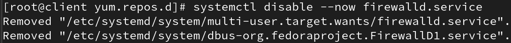{width="5.7625in"
height="0.4708333333333333in"}

[Create a multiple directories:]{.underline}

You can create directories with a numerical sequence in their names, for
instance, dir1, dir2, etc., using brace expansion with a range. 

Syntax:

#mkdir dir_name{1..n}

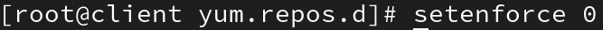{width="5.761805555555555in"
height="0.8722222222222222in"}

[ls commands:]{.underline}

[Show a detailed listing of files:]{.underline}

The ls -l command in Linux is used to display a detailed listing of
files and directories within a given directory.

Syntax:

#ls -l

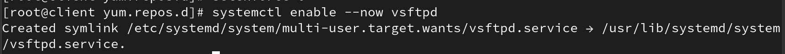{width="4.741666666666666in"
height="3.8666666666666667in"}

Detailed listing of Particular file:

Syntax:

#ls -l file_name

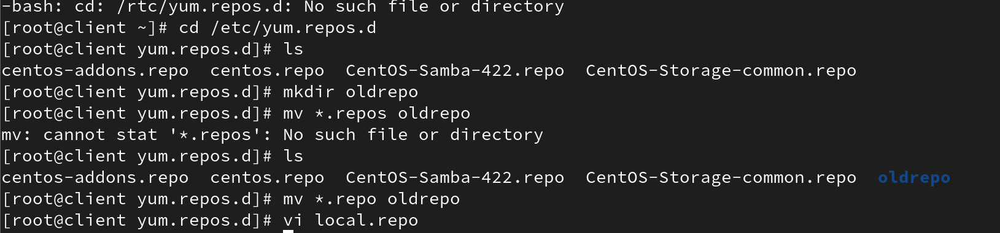{width="5.083333333333333in"
height="0.36666666666666664in"}

Detailed listing of Particular directory:

Syntax:

#ls -l dir_name

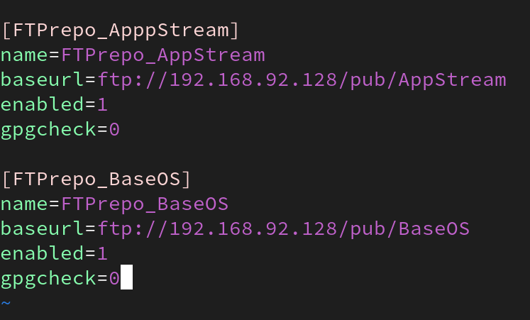{width="5.591666666666667in"
height="0.6916666666666667in"}

- r: Read permission is granted.

- w: Write permission is granted.

- 1: This number indicates the number of hard links to the file.

- root root: These indicate the owner and the group owner of the file.
  In this case, both the owner and the group owner are \'root\'.

- 0: This represents the size of the file in bytes. Here, the file size
  is 0 bytes, meaning it\'s an empty file.

- Aug 22 14:28: This is the timestamp indicating the last modification
  time (mtime) of the file.

- file1: This is the name of the file. 

  [Show all Hidden long listing files/directories:]{.underline}

  The ls -a command in Linux is used to list all files and directories,
  including hidden files (those whose names begin with a dot). 

  Syntax:

  #ls -a

  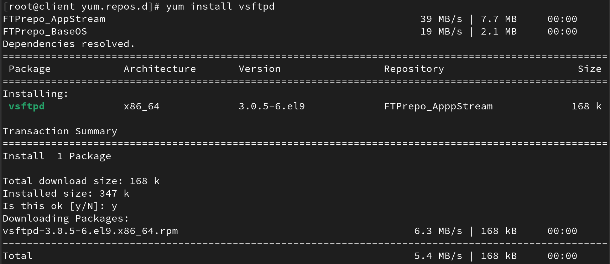{width="5.764583333333333in"
  height="0.3902777777777778in"}

  [Omitting . , .. files:]{.underline}

  Syntax:

  #ls -A

  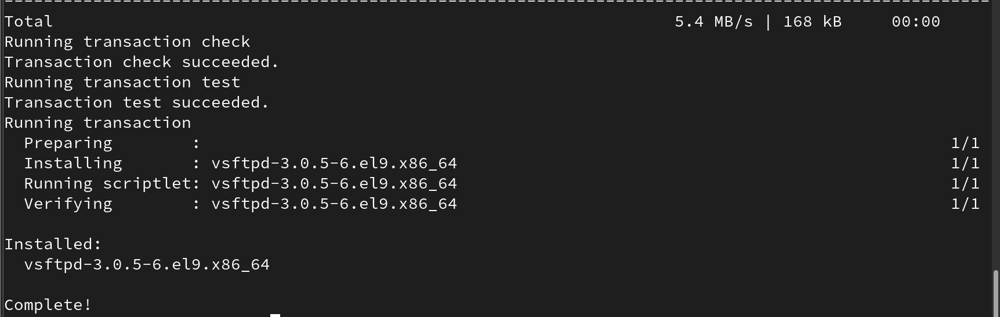{width="5.767361111111111in"
  height="0.3909722222222222in"}

  [Show long listing files based timing:]{.underline}

  The ls -lt command in Linux is used to display the contents of a
  directory in a detailed or \"long\" format, sorted by the last
  modification time, with the most recently modified files and
  directories appearing first. 

  Syntax:

  #ls -lt

  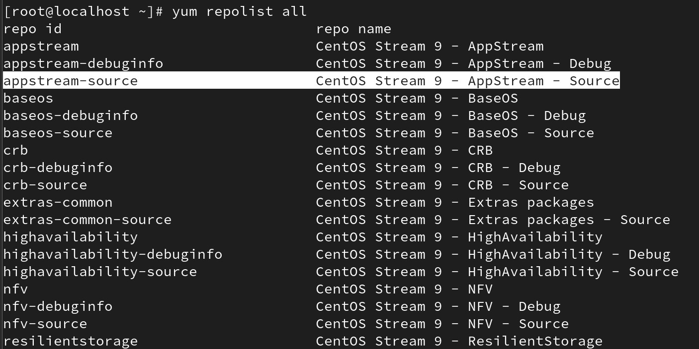{width="4.117361111111111in"
  height="2.7604166666666665in"}

  [Show long listing files based sizes:]{.underline}

  The ls -lS command in Linux is used to list the contents of a
  directory in a long format and sort them by file size, with the
  largest files appearing first. 

  Syntax:

  #ls -lS

  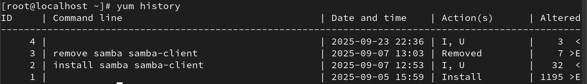{width="4.541666666666667in"
  height="3.7916666666666665in"}

  [Reverse the long listing files:]{.underline}

  Syntax:

  #ls -lr

  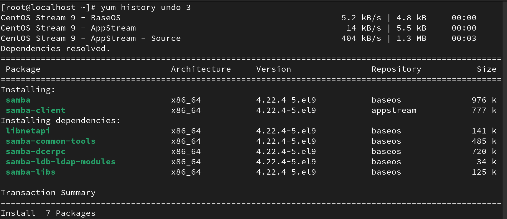{width="4.966666666666667in"
  height="3.841666666666667in"}

  [Show the files by time with reverse order:]{.underline}

  The ls -ltr command in Linux is used to display the contents of a
  directory in a specific format, sorted by time, and in reverse order.

  Syntax:

  #ls -ltr

  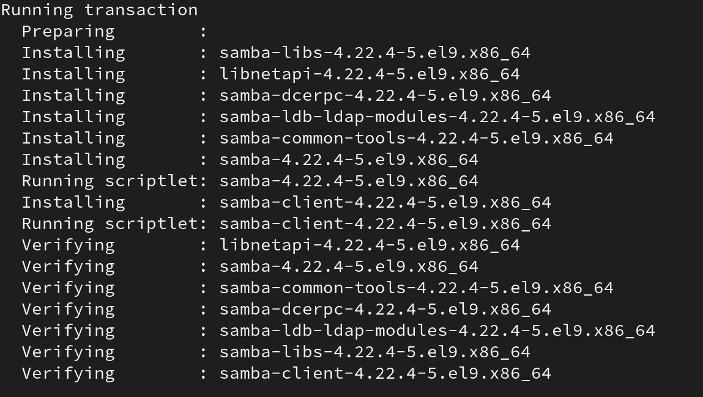{width="4.375in"
  height="3.7916666666666665in"}

  [Show the files by Sizes with reverse order:]{.underline}

  The ls -lSr command in Linux is used to display the contents of a
  directory in a specific format, sorted by size, and in reverse order.

  Syntax:

  #ls -lSr

  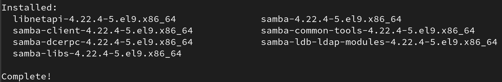{width="4.991666666666666in"
  height="3.9in"}

  [Show the particular present file/directory:]{.underline}

  The ls -d command treats the directory as a file itself and displays
  details about it.

  Syntax:

  #ls -d

  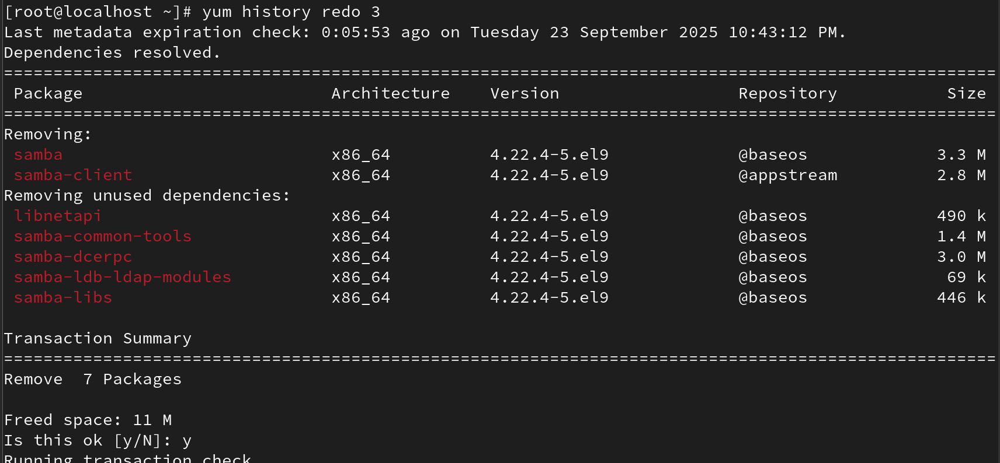{width="3.9583333333333335in"
  height="1.4666666666666666in"}

  Syntax:

  #ls -ld file_name

  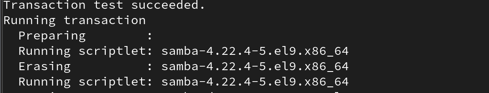{width="3.6083333333333334in"
  height="0.5666666666666667in"}

  Indicate inode numbers:

  The ls -i command in Linux displays the inode number of files and
  directories.

What is an Inode?

Inodes (index nodes) are data structures that store metadata about files
and directories in a Linux. Inodes are unique identifiers for each file
or directory. 

Syntax:

#ls -i

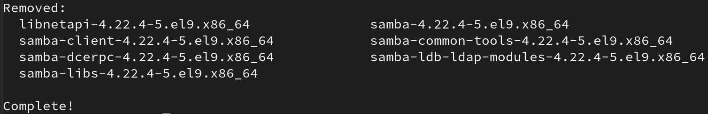{width="5.760416666666667in"
height="0.44930555555555557in"}

Syntax:

#ls -li

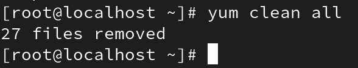{width="5.008333333333334in"
height="3.783333333333333in"}

[Display the content of file:]{.underline}

The cat command in Linux is used for displaying file contents. 

Syntax:

#cat file_name

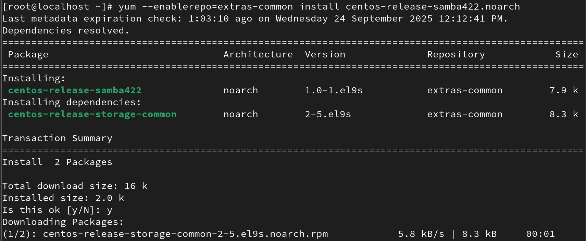{width="2.6083333333333334in"
height="0.7in"}

[Show the details for commands:]{.underline}

The "man" command in Linux is used to display the manual pages (short
for \"manual\") for commands and utilities within the system. 

Syntax:

#man ls

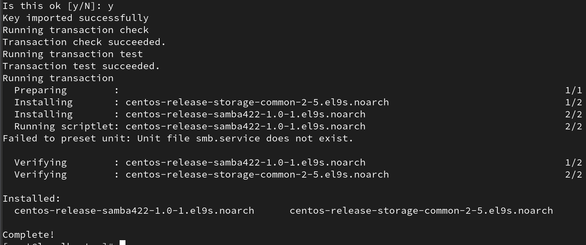{width="5.758333333333334in"
height="3.2875in"}

[Switch to another account:]{.underline}

The su command in Linux, which stands for \"switch user,\" is a
fundamental utility used to change the current user account within a
terminal session. 

Syntax:

#su manju

If you also switch to another user account on your system, no need to
put your password.

If you also switch to root account on your system, to provide your
account password.

. Once switched, you remain as that user until you explicitly exit or
log out and remember to logout the account.

[Again go to the root directory from user directory:]{.underline}

Syntax:

#su -

In root account syntax is start with \# symbol and the user account
syntax is start with \$.

[Create parent directories:]{.underline}

The -p (or \--parents) option in mkdir enables the creation of parent
directories if they don\'t already exist.

Syntax:

mkdir -p 1^st^ dir_name/2nd dir_name/3rd dir_name

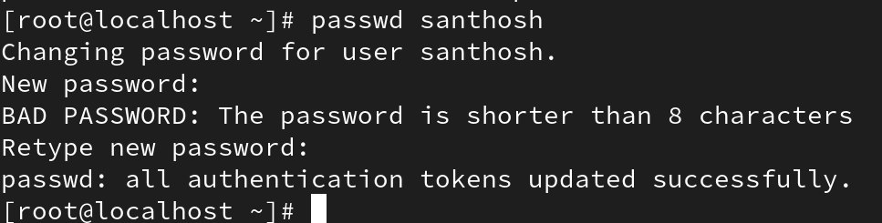{width="4.258333333333334in"
height="2.1666666666666665in"}

[View the parent directories:]{.underline}

The tree command in Linux is a utility that displays the contents of
directories in a hierarchical, tree-like format. It provides a visual
representation of the file system structure, making it easier to
understand the relationships between directories and files.

Syntax:

#tree dir_name

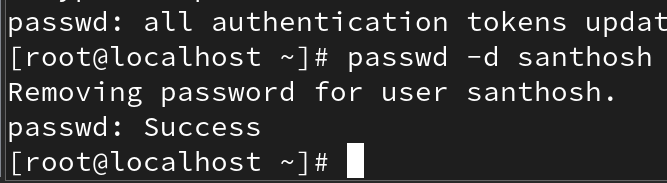{width="2.75in"
height="1.5583333333333333in"}

To Remove Directories:

The "rmdir" command is used to only remove empty directories.

Syntax:

#rmdir dir_name

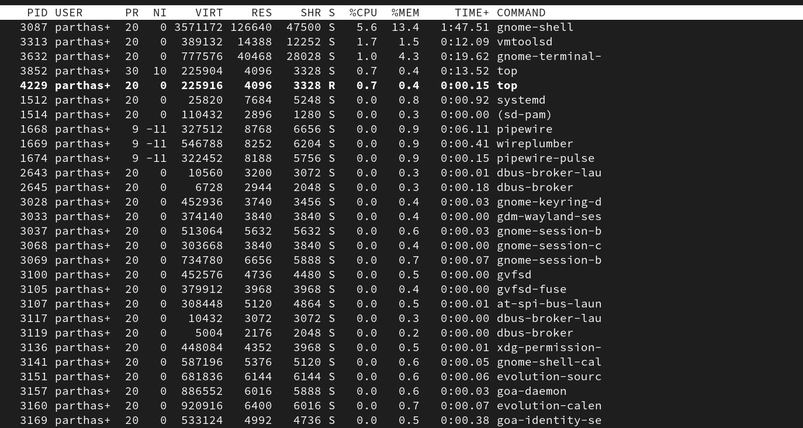{width="5.764583333333333in"
height="0.8895833333333333in"}

If you have one directory, this directory contains one or more files.You
cannot delete this directory.

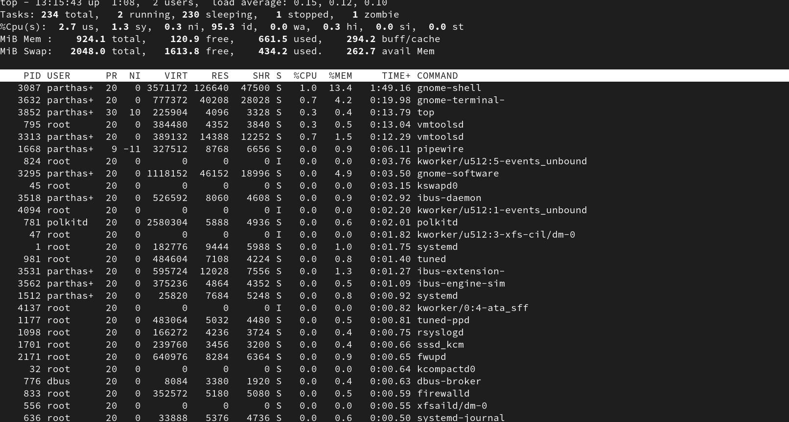{width="4.55in" height="0.375in"}

If you need to delete the directories and their contents, you can use
'rm -r' command.

Syntax:

#rm -r dir

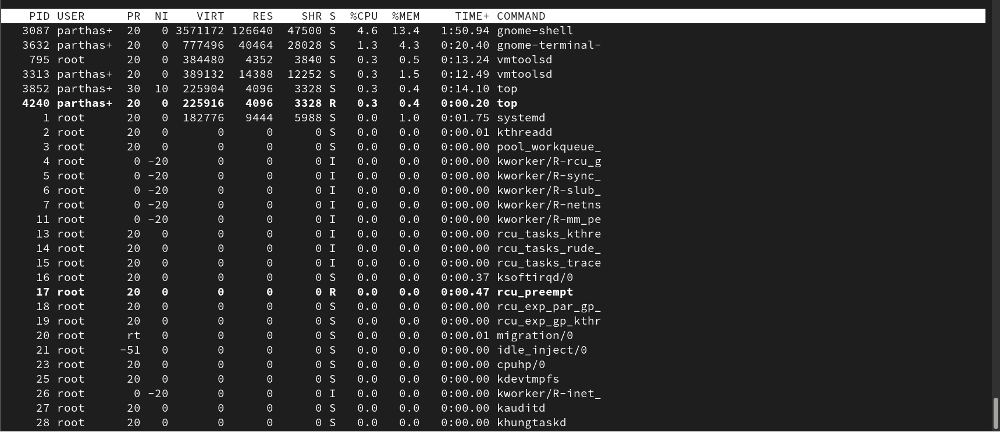{width="3.566666666666667in"
height="0.7833333333333333in"}

The rm -r command in Linux is used to delete directories and their
contents recursively. This means that when you use rm -r, you are
telling the system to remove not only the specified directory but also
all the files and subdirectories it contains.

In this command to use , ask everytime yes or No to remove your
directory and their contents.

If you want to forcefully remove your directory and their contents, you
can use "rm -rf" command.

Syntax:

#rm -rf dir

[Remove multiple directories:]{.underline}

If you want to delete the directories and their numerical numbers in
their names, you can use the command in below.

Syntax:

#rmdir dir_name\*

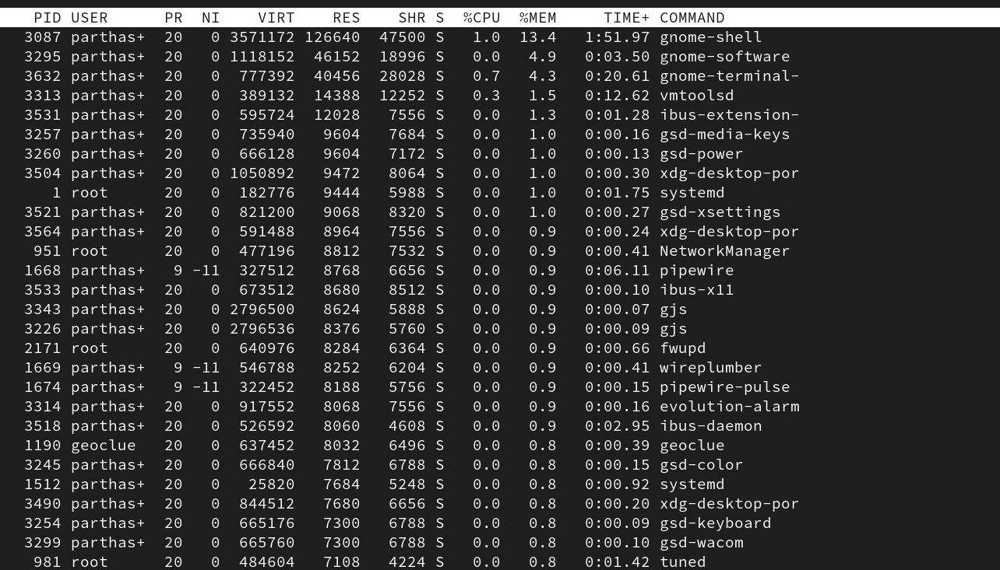{width="5.7659722222222225in"
height="0.8555555555555555in"}

[Remove directory with numerical sequence:]{.underline}

Syntax:

#rm -r dir\*

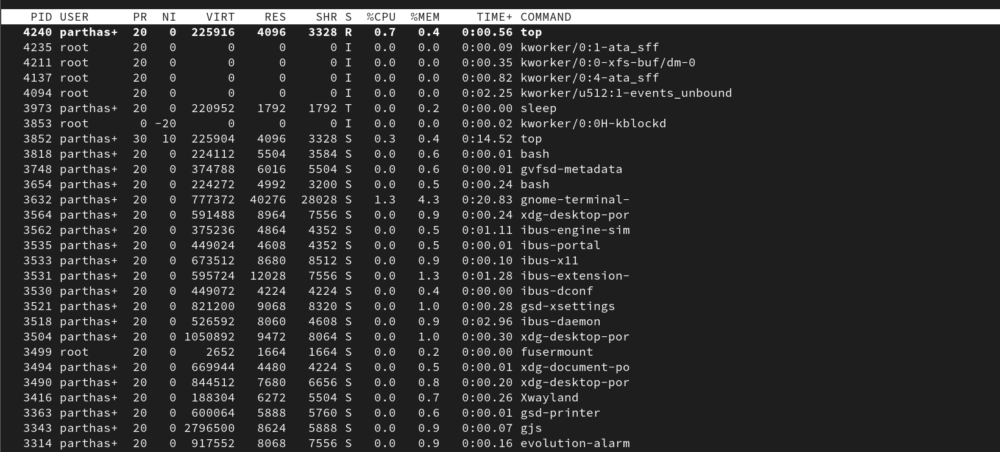{width="5.764583333333333in"
height="0.6076388888888888in"}

Syntax:

#rm -rf exmp\*

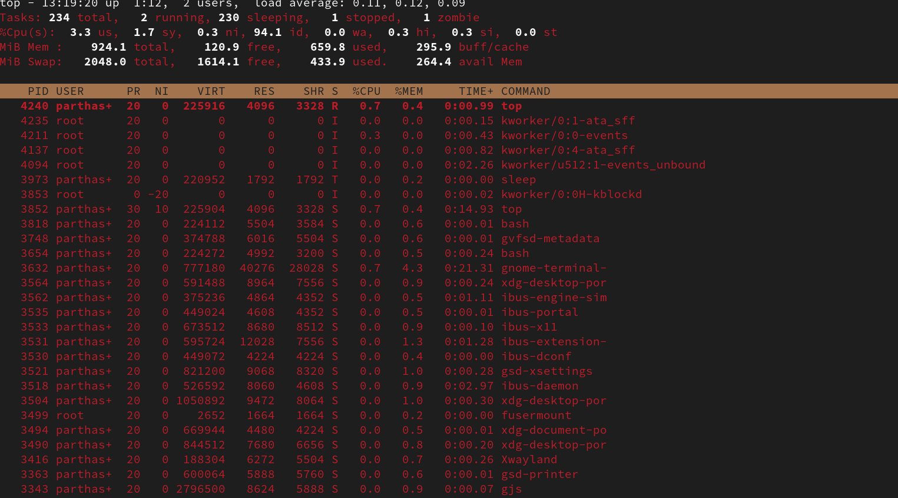{width="5.758333333333334in"
height="0.6555555555555556in"}

[Delete files:]{.underline}

Syntax:

#rm -f file\*

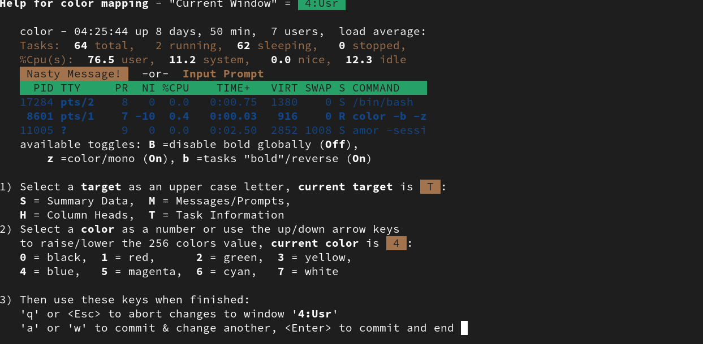{width="5.7652777777777775in"
height="0.44027777777777777in"}

[View&edit file:]{.underline}

Syntax:

#cat \> test

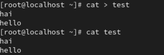{width="2.7666666666666666in"
height="0.9416666666666667in"}

\> symbol is used to ovverriding text.

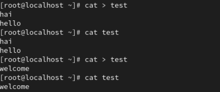{width="3.775in"
height="1.5833333333333333in"}

#cat \>\> test

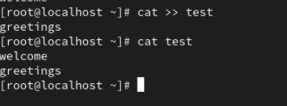{width="3.0416666666666665in"
height="1.125in"}

\>\> This append symbol is used to adding text in files.

[Print Text:]{.underline}

Syntax:

#echo "hello"

If you print the text use " " or ' ' symbol.

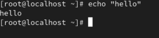{width="2.625in"
height="0.6333333333333333in"}

To add the text in files:

Syntax:

#echo "hello" \> file

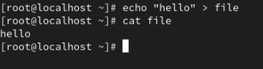{width="3.1416666666666666in"
height="0.825in"}

#echo "hai" \>\> file

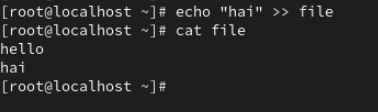{width="3.15in"
height="0.9333333333333333in"}

Print first 10 lines:

Display the beginning of first 10 lines.

Syntax:

#head file_name

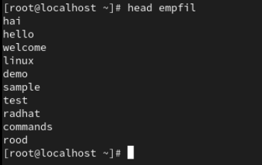{width="3.075in"
height="1.9416666666666667in"}

#head -12 file_name

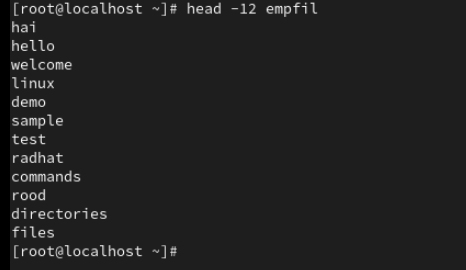{width="3.8833333333333333in"
height="2.25in"}

Print last some lines:

Display the end of last 10 lines.

Syntax:

#tail empfil

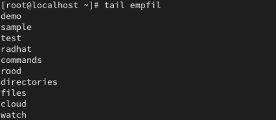{width="3.9in" height="1.7in"}

#tail -13 empfil

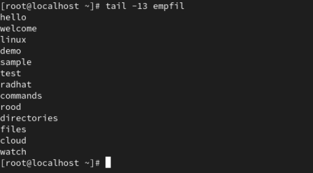{width="4.341666666666667in"
height="2.4in"}

[Less and more functions:]{.underline}

less command:

Purpose:

A more advanced pager than more, offering enhanced navigation and search
capabilities.

Navigation:

- Allows both forward and backward movement.

- Use Up arrow or k to move up one line.

- Use Down arrow or j to move down one line.

- Press g to go to the beginning of the file.

- Press G to go to the end of the file.

- Press q to quit.

  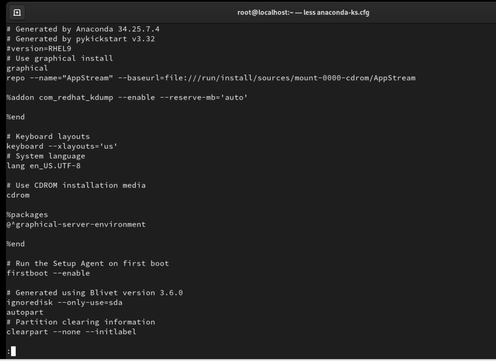{width="4.580555555555556in"
  height="3.3354166666666667in"}

  More command:

  Purpose: Displays file content page by page.

  Navigation: Primarily allows forward movement.

  - Press Spacebar to advance one page.

  - Press Enter to advance one line.

  - Press q to quit.

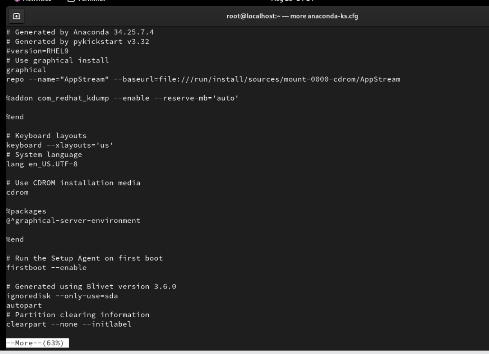{width="5.06875in"
height="3.667361111111111in"}

[Absolute path:]{.underline}

An absolute path specifices the complete location of a file/directory
starting from the root directory (/).

It always begins with a forward slash (/).

Syntax:

/home/manju/file/test

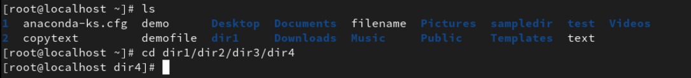{width="5.764583333333333in"
height="0.6527777777777778in"}

[Relative path:]{.underline}

A relative path specifies the location of a file/directory in relation
to the current working directory (the directory you are currently in).

It doesn't start with (/) a forward slash.

Syntax:

cd dir3/dir4

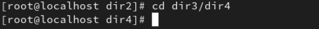{width="4.433333333333334in"
height="0.4083333333333333in"}

[To copy files:]{.underline}

The "cp" command is used to copy files and directories from one location
to another location.( Push and pull is possible in cp command.)

It is a fundamental command for managing files within the file system.

Syntax:

cp source_name destination_name

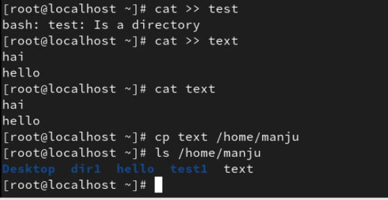{width="4.65in" height="2.4in"}

[Copying multiple files:]{.underline}

Syntax:

cp file1 file2 destination_path

{width="4.133333333333334in"
height="0.8166666666666667in"}

[Copying directories recursively:]{.underline}

Syntax:

cp -r dir_name destination_path

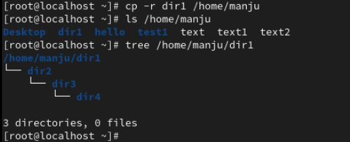{width="4.183333333333334in"
height="1.7in"}

[To pull the file from one path to another path:]{.underline}

Syntax:

cp source_path destination_path

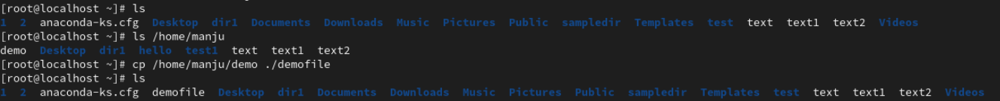{width="5.7659722222222225in"
height="0.5861111111111111in"}

The demo file is renamed to demofile.

The . symbol is indicate root user.

[To move the file:]{.underline}

The "mv" command is used for two purposes:

1.  Moving files/directories.

2.  Renaming files/directories.

<!-- -->

1.  Moving files/directories:

    To move a file/directory from one location to another location.

    Syntax:

    mv source destination

    To moving file:

    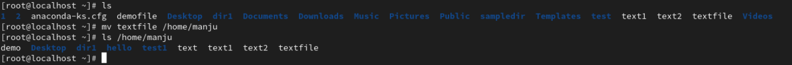{width="5.760416666666667in"
    height="0.48125in"}

    To moving directory:

    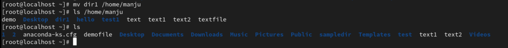{width="5.7659722222222225in"
    height="0.5493055555555556in"}

    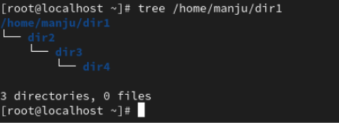{width="3.6in"
    height="1.3083333333333333in"}

2.  Rename files/directories:

    Rename file name:

    Syntax:

    mv old_name new_name

    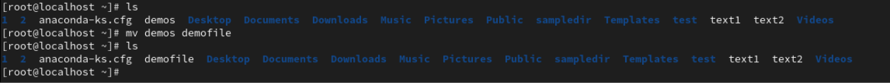{width="5.761111111111111in"
    height="0.5451388888888888in"}

    Rename directory name:

    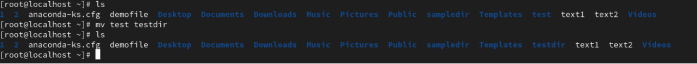{width="5.759027777777778in"
    height="0.5326388888888889in"}

    [Clear command:]{.underline}

    The "clear" command is used to clear the terminal screen.

    It is removes all the previous output and commands from the terminal
    and providing a clean slate for further operation.

    [Uname:]{.underline}

    The "uname" is an abbreviation for "UNIX name".

    When executed without any options, uname typically displays the
    kernal name. (e.g.Linux)

    [ifconfig:]{.underline}

    An "ifconfig" command is used for display the information about IP
    addresses.

    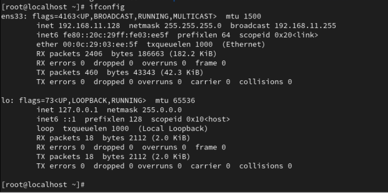{width="4.114583333333333in"
    height="2.0520833333333335in"}

    [df -h:]{.underline}

    The "df -h" command is useful when you want to see how much disk
    space is in use on particular partition and how much is left.

    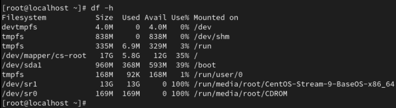{width="5.763888888888889in"
    height="1.5708333333333333in"}

    [whoami:]{.underline}

    This command is used to display the username of the current
    effective UserID (EUID) operating the shell or script.

    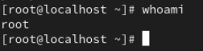{width="2.1in"
    height="0.5333333333333333in"}
