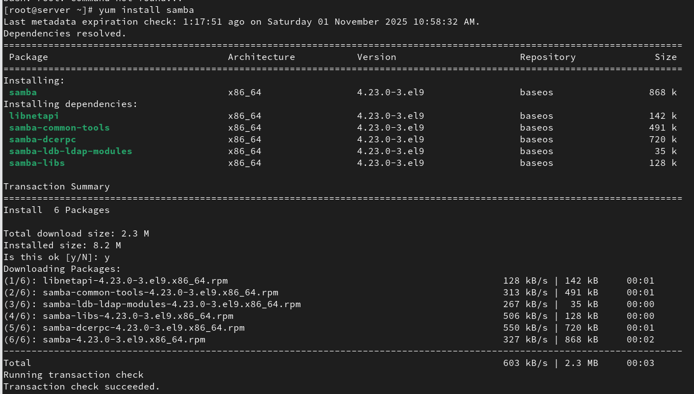
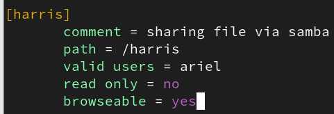
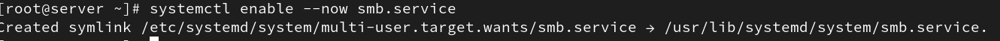
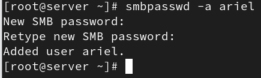
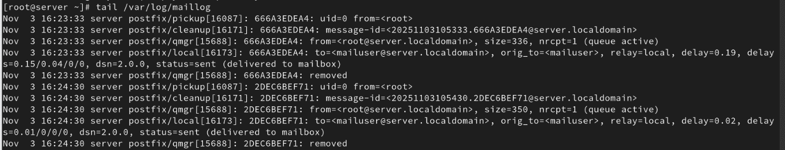
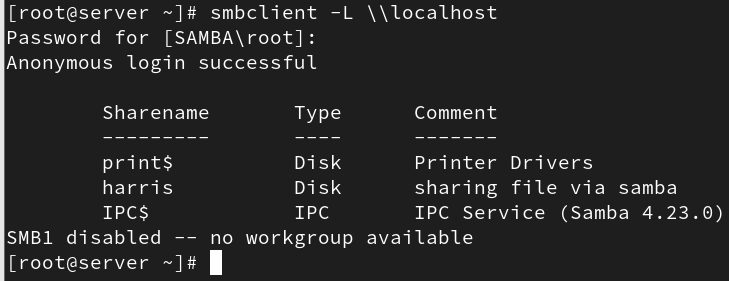
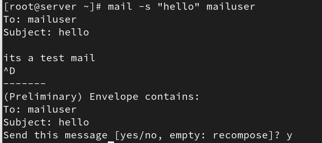
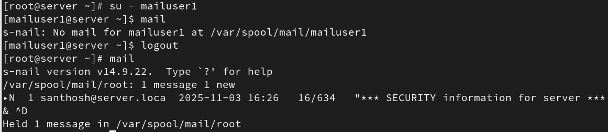

SMTP(Simple Mail Transfer Protocol)

Package Name : postfix

Configuration file : /etc/postfix/main.cf

Port number : 25

Service name : postfix.service

Postfix:

Postfix is a software program that acts as a mail server on Linux
systems. Its main job is to send and receive emails between computers
over the internet.

Install package:

\# yum install postfix

{width="6.268055555555556in"
height="3.259027777777778in"}

Start and enable Postfix so it runs after a reboot:

\# systemctl enable \--now postfix.service

{width="6.268055555555556in"
height="0.26319444444444445in"}

Edit configuration file:

#vi /etc/postfix/main.cf

{width="1.8125929571303587in"
height="0.2569575678040245in"}

Restart the service

\# systemctl restart postfix.service

{width="4.277997594050744in"
height="0.2708475503062117in"}

Create a user

\# useradd mailuser

{width="2.8195898950131233in"
height="0.2708475503062117in"}

Sending mail to a user:

\# mail -s \"Test Email\" mail@localhost

{width="6.268055555555556in"
height="1.4784722222222222in"}

To check logs of mail:

\# tail /var/log/maillog

{width="6.268055555555556in"
height="1.2020833333333334in"}

Check mail is send to another user:

\# su -- mailuser

\# mail

{width="5.78501968503937in"
height="4.583568460192476in"}

Create one user and add multiple users in config file:

\# vi /etc/ aliases

{width="2.5348523622047243in"
height="0.2916819772528434in"}

Save the file and update aliases:

\# newaliases

{width="2.3473425196850393in"
height="0.4027985564304462in"}

Send mail to a group:

\# mail -s "subject" groupname

{width="4.354390857392826in"
height="1.9306550743657043in"}

Check mail is send to 2 users:

{width="6.268055555555556in"
height="1.3604166666666666in"}
