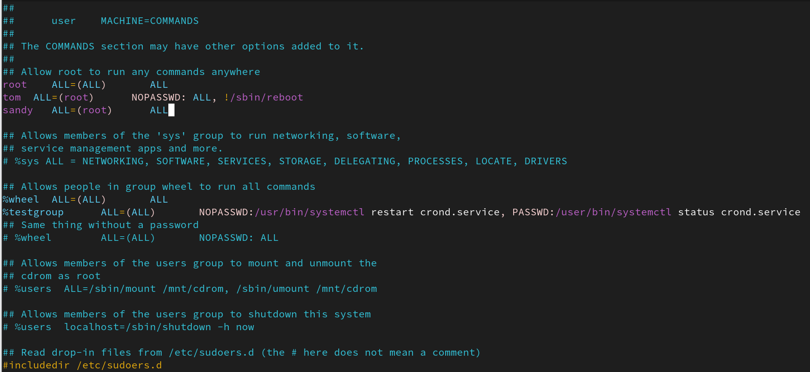
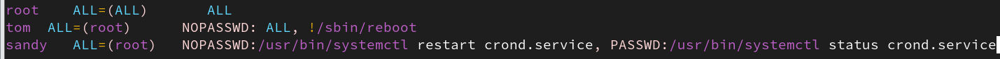
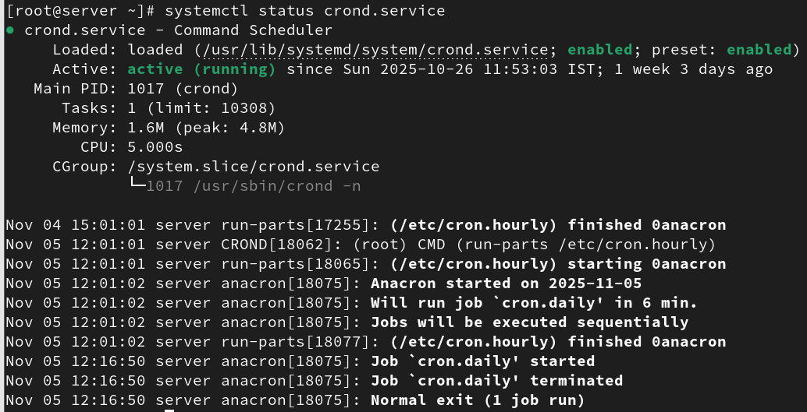
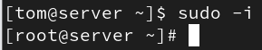

Sudo

What is sudo:

Sudo (super user do)sudo runs a command as root, whereas su makes you
root user.

sudo :- Allows a permitted user to execute a command as a super user as
specified in the SUDOER\'s file .

SUDO runs a single command with root privilege. SUDO it doesn't switch
to the root user or require a separate root user password.

Sudo configuration file:

#vi /etc/sudoers

(or)

#visudo

Syntax for individual user:

===============================

User HOST=RunAs NOPASSWD:COMMAND

mahesh ALL=(ALL) ALL

balaji ALL=(ALL) ALL

{width="5.768055555555556in"
height="2.65625in"}

User HOST=RunAs(user) NOPASSWD:COMMAND

mahesh ALL=(balaji) ALL

Syntax for individual group:

==============================

%group HOST=RunAs NOPASSWD:COMMAND

%admin ALL=ALL ALL

In %wheel group =\> sudo access is set as default.

balaji ALL=(ALL) NOPASSWD:/usr/bin/systemctl restart crond.service,
PASSWD:/usr/bin/systemctl status crond.service

mahesh ALL=(ALL) ALL

daniel ALL=(ALL) !/bin/su !/bin/bash !/reboot

niresh ALL=(daniel) ALL

{width="5.768055555555556in"
height="0.34305555555555556in"}

{width="5.768055555555556in"
height="2.9506944444444443in"}

List User Privileges:

#sudo -l (or) #sudo --list

{width="5.768055555555556in"
height="0.7652777777777777in"}

#sudo -U user_name -l

{width="5.768055555555556in"
height="0.7993055555555556in"}

Change Your Interactive Shell

#sudo -I

{width="2.007047244094488in"
height="0.38890857392825895in"}

Aliases in sudoers file

=============================

User_Alias

Host_Alias

Cmnd_Alias

Host_Alias MAILSERVERS = smtp, smtp2

Cmnd_Alias DELEGATING = /usr/sbin/visudo, /bin/chown, /bin/chmod,
/bin/chgrp

User_Alias ADMINS = mahesh, niresh, daniel

User_Alias ADMINS = balaji, muthu, vicky

Cmnd_Alias ALLOW_CMD = /usr/sbin/fdisk ,/usr/sbin/useradd

Cmnd_Alias DENY_CMD=!/bin/su,!/usr/sbin/reboot,!/usr/bin/passwd

#Host_Alias MAILSERVERS = smtp, smtp2

ADMINS ALL=(ALL) ALLOW_CMD,DENY_CMD

#daniel ALL=(ADMINS) NOPASSWD: PROCESSES ,DELEGATING

ADMINS ALL=(ALL) NOPASSWD: PROCESSES ,DELEGATING

balaji ALL=(ALL) NOPASSWD: PROCESSES #,DELEGATING
